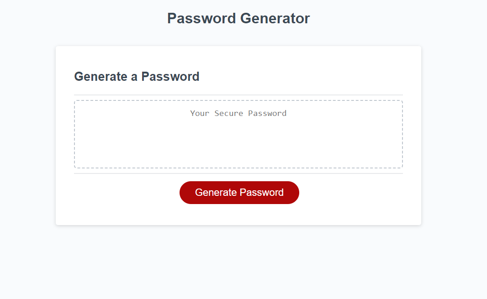

# Password-Generator

## This application generated a random password based on the user's selected criteria. The user can select the length of the password, whether they want certain characters, and whether they want numbers in their password. Hitting the Generate Password button repeats the process and produces a new password. The bulk of this depends on the JavaScript code, allowing for different functions and decisionmaking producing the password.

## Follow the link below to access the program.

https://djamesclark.github.io/Password-Generator/

